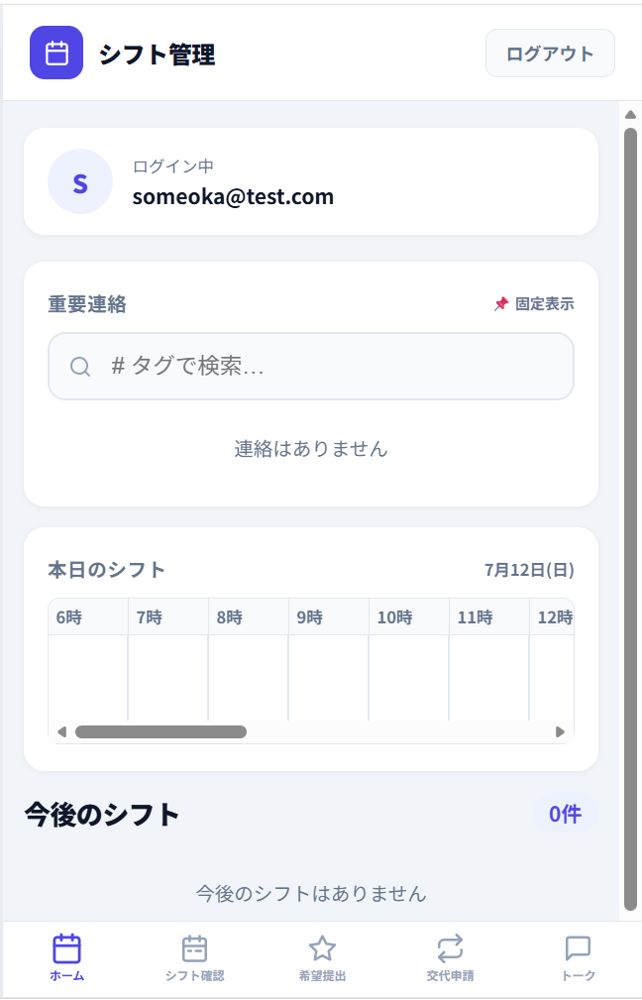
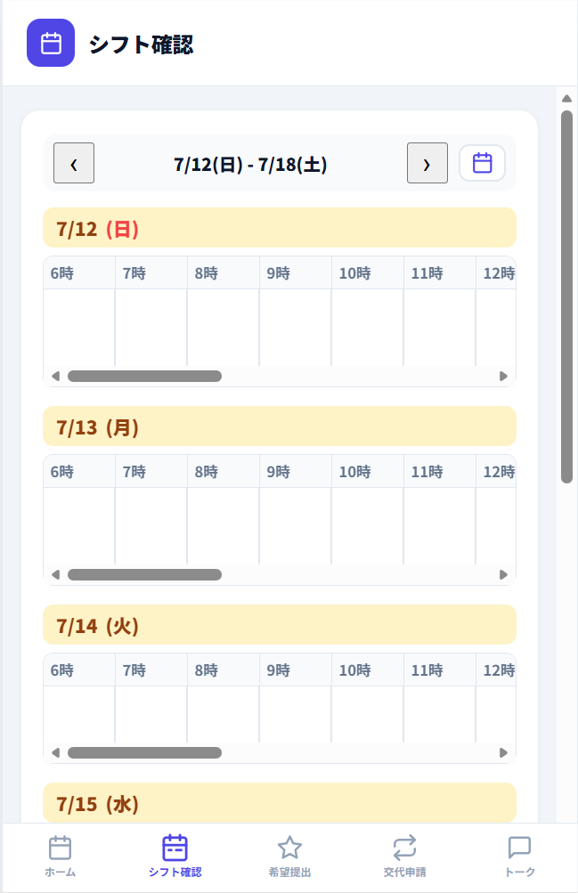
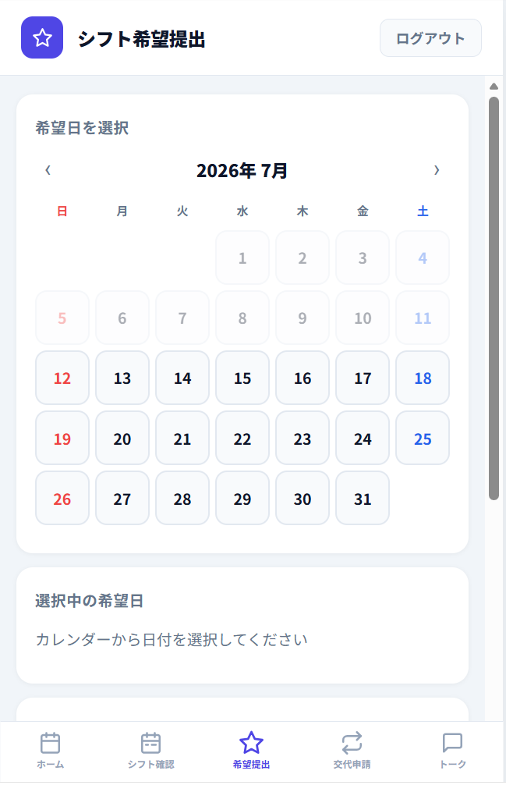
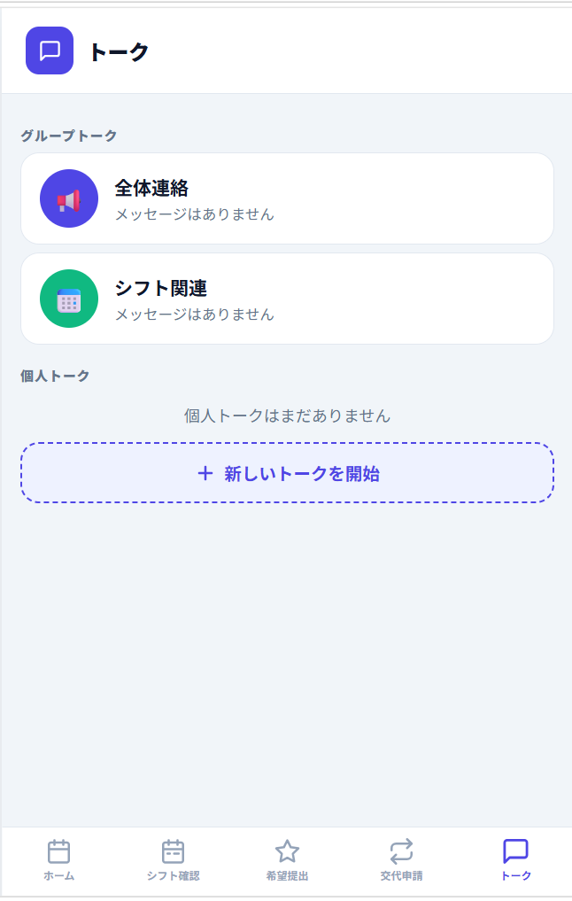
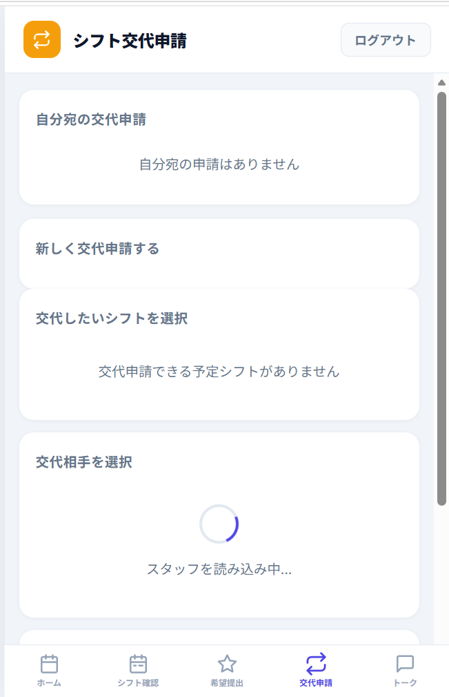
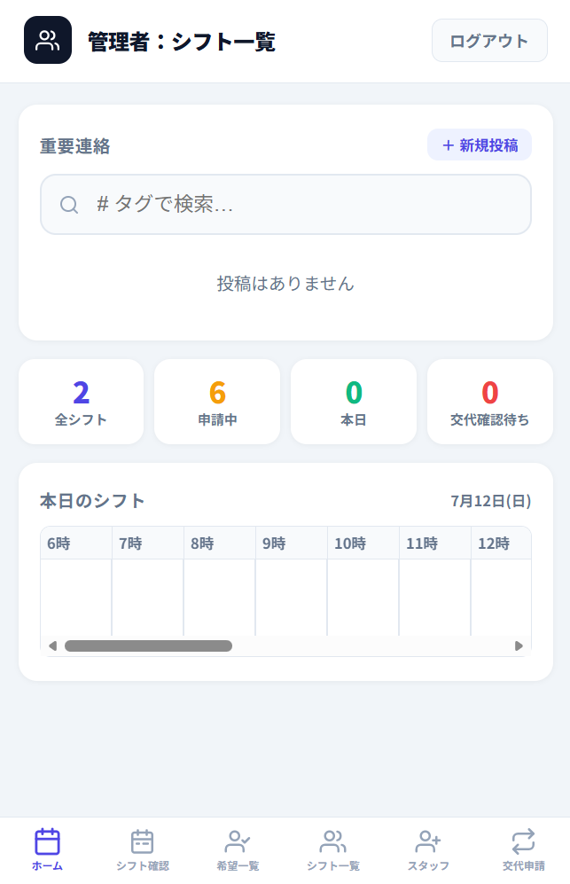
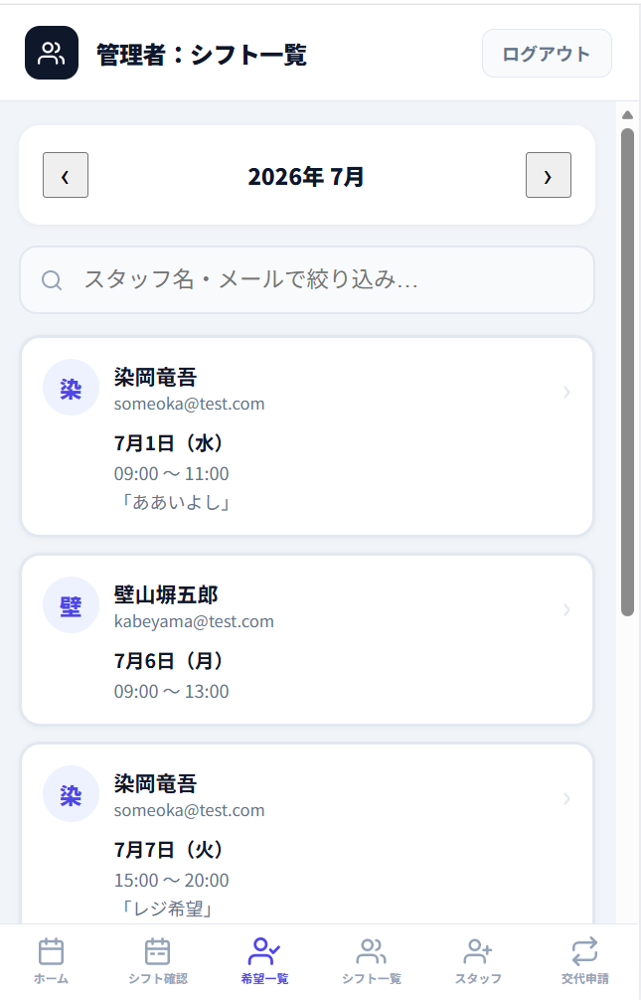
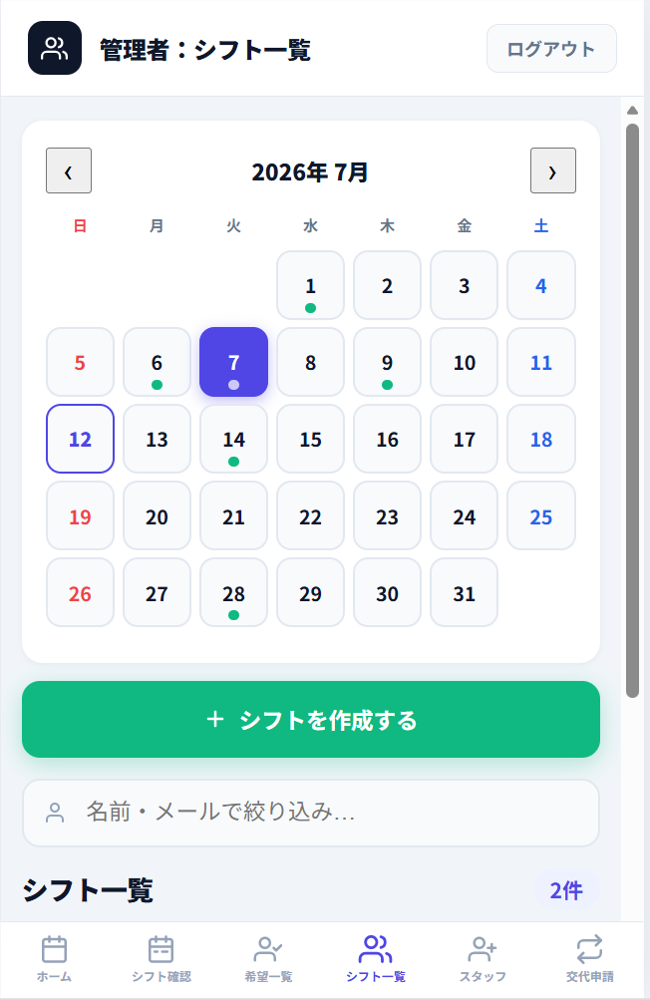
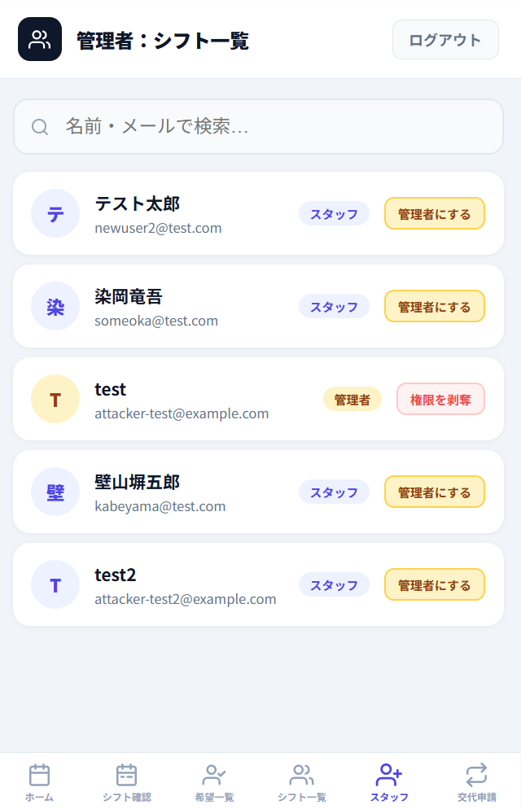
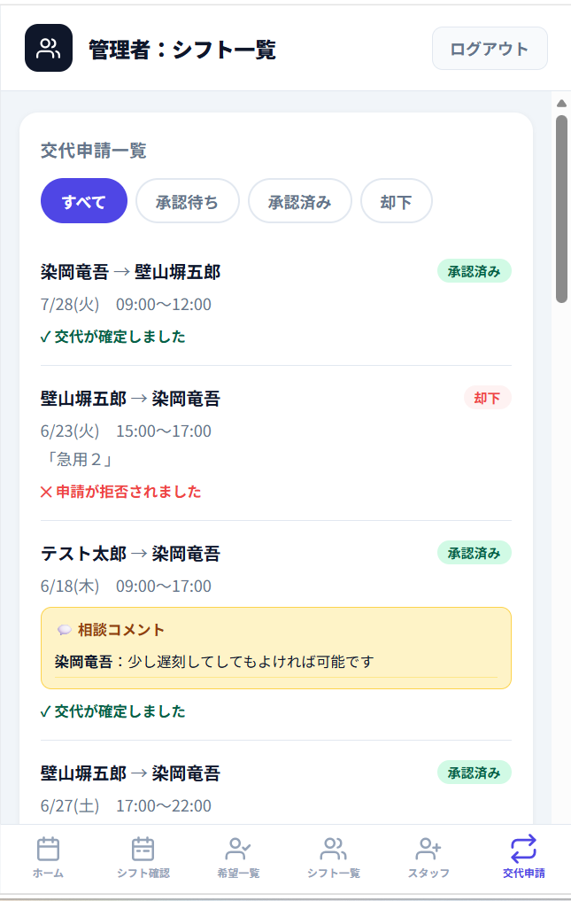

<div align="center">

# 🗓️ シフト管理アプリ

**アルバイトのシフト管理を、LINEと紙から解放する。**
シフト希望の提出・確認・交代申請、そして現場連絡までを、スタッフと店長がひとつのアプリで完結できるサーバーレスWebアプリです。

<br>


</div>

---

## 📑 目次

- [プロジェクト概要](#-プロジェクト概要)
- [解決したい課題](#-解決したい課題)
- [主な機能](#-主な機能)
- [技術スタック](#-技術スタック)
- [システムアーキテクチャ](#-システムアーキテクチャ)
- [🔐 セキュリティへの取り組み](#-セキュリティへの取り組み)
- [アプリ画面](#-アプリ画面)
- [API一覧](#-api一覧)
- [開発プロセス・チーム運営](#-開発プロセスチーム運営)
- [チーム構成と各自の取り組み](#-チーム構成と各自の取り組み)
- [開発期間](#-開発期間)

---

## 🎯 プロジェクト概要

飲食店のアルバイトにおけるシフト管理は、いまだにLINEや紙が中心で、「連絡の埋没」「店長の集計負担」「交代の属人化」といった課題を抱えています。

本アプリは、これらをWeb上で一元管理し、**スタッフと店長の双方の負担を減らすこと**を目的に、PM・フロントエンド・バックエンドの3人チームで開発しました。シフト希望の提出から店長による確定、スタッフ間の交代申請（承認フロー付き）、さらに現場の重要連絡や多言語トークまでを、権限（管理者／スタッフ）に応じた画面で扱えます。

従業員の個人情報（勤務予定・連絡先）を扱うアプリであるため、**開発完了後にはOWASP Top 10 を指針としたセキュリティ診断を実施し、発見した脆弱性を検証・修正するプロセスまで行いました**（詳細は[セキュリティへの取り組み](#-セキュリティへの取り組み)を参照）。

---

## 💡 解決したい課題

| 課題 | 従来のやり方 | 本アプリでの解決 |
|---|---|---|
| **シフト連絡の埋没** | LINEのトークに流れて見失う | 提出・確認をアプリに集約し、カレンダーで可視化 |
| **集計作業の負担** | 店長が希望を手作業で集計 | 希望を一覧化し、タップ操作でシフト確定 |
| **交代の属人化** | 個人間の口約束で成立 | 承認フロー付きの交代申請機能で記録・可視化 |
| **重要連絡の見落とし** | 口頭・貼り紙で伝達漏れ | 配信＋理解度リアクションで既読・理解を可視化 |
| **多国籍スタッフの言語障壁** | 日本語が読めず連絡が伝わらない | トークの多言語自動翻訳（英・中・越）に対応 |

---

## 🚀 主な機能

### スタッフ向け
- **ログイン・新規登録** — AWS Cognito と直接連携し、JWTで権限（管理者／スタッフ）を判定
- **シフト確認** — カレンダーとリストで自分のシフトを表示
- **シフト希望提出** — カレンダーから複数日をまとめて選択して提出
- **シフト交代申請** — 「代われる／無理／相談」の3択で回答する承認フロー
- **重要連絡＋理解度リアクション** — 店長の連絡に「👍 理解／△ あとで／❓ 質問」で反応
- **多言語トーク** — グループ／個人チャットを英語・中国語・ベトナム語に自動翻訳

### 管理者向け
- **シフト作成・確定** — カレンダーで絞り込み、希望をタップして確定
- **希望一覧** — 月別でスタッフの希望を確認し、その場でシフト化
- **スタッフ管理** — 管理者権限の付与・剥奪
- **交代申請管理** — 全申請の確定／拒否
- **理解度ダッシュボード** — 重要連絡へのリアクション状況を集計表示

---

## 🛠 技術スタック

| カテゴリ | 技術 | 選定理由・工夫 |
|---|---|---|
| **フロントエンド** | HTML / CSS / JavaScript | モバイルファーストの単一ファイル構成。スマホでの現場利用を最優先 |
| **バックエンド** | TypeScript / AWS Lambda (Node.js 20) | 型安全なAPI実装。関数単位でスケールするサーバーレス |
| **データベース** | AWS DynamoDB | GSI設計で「自分のシフト」検索を最適化し、全件スキャンを回避 |
| **認証・認可** | AWS Cognito (JWT) | 認証はCognito、認可はLambda内で判定する二段構え |
| **インフラ** | AWS SAM / API Gateway | IaCでインフラ全体をコード化し、再現可能なデプロイを実現 |
| **開発フロー** | GitHub (Issue / PR / ブランチ運用) | main直コミット禁止・featureブランチ・PRレビュー必須のルールを整備 |

---

## 🏗 システムアーキテクチャ

```
┌─────────────────────────────┐
│   ブラウザ (index.html)       │  モバイルファースト / 単一ファイル
│   ・シフト表示・希望提出       │
│   ・トーク（多言語翻訳）       │
└──────────────┬──────────────┘
               │  HTTPS ＋ JWT（Cognito IDトークン）
               ▼
┌─────────────────────────────┐
│   Amazon API Gateway         │  ── Cognito Authorizer で【認証】
└──────────────┬──────────────┘
               │
               ▼
┌─────────────────────────────┐
│   AWS Lambda (TypeScript)    │  ── Lambda内で【認可】
│   21個のハンドラ関数           │     （isAdmin 判定 / 本人確認）
└──────────────┬──────────────┘
               │
               ▼
┌─────────────────────────────┐
│   Amazon DynamoDB            │  GSIで自分のシフトを効率検索
│   Users / Shifts / Wishes /  │  TransactWrite で交代の整合性担保
│   SwapRequests / Notices     │  BatchGet で N+1 を回避
└─────────────────────────────┘

  すべて AWS SAM (IaC) でコード管理・デプロイ
```

**設計のポイント**

- **認証と認可の分離** — 「ログインしているか（認証）」はAPI Gateway + Cognitoが担い、「その操作をしてよい人か（認可）」はLambda内で判定。責務を明確に分けている
- **データ整合性** — シフト交代の承認は複数テーブルの同時更新が必要なため、`TransactWriteItems` でアトミックに処理し、中途半端な状態を防止
- **クエリ最適化** — `GSI` で自分のシフトを直接引き、`BatchGetCommand` で関連データをまとめて取得することでN+1問題を回避

---

## 🔐 セキュリティへの取り組み

> このプロジェクトの最大の特徴は、**「動くものを作って終わり」にしなかった**ことです。
> 従業員の個人情報を扱うアプリとして、**完成後に自分たちのコードをセキュリティ診断し、脆弱性を発見 → 検証 → 修正 → 再検証するループ**を実施しました。

### 診断のアプローチ

| フェーズ | 内容 |
|---|---|
| **① 静的診断** | OWASP Top 10 を指針に、認証・認可・入力値処理・シークレット管理・個人情報の露出・依存パッケージなどを観点にコードレビュー |
| **② 検証（再現）** | 発見した脆弱性を `curl` やブラウザで実際に再現し、「本当に悪用可能か」をHTTPステータス等で確認 |
| **③ 修正・再検証** | 修正後、同じ手順で再検証し、脆弱性が解消したことを確認（例：`200 → 403` の変化を確認） |

### 発見・修正した主な脆弱性

<table>
<tr>
<th>#</th><th>脆弱性</th><th>内容</th><th>対応</th><th>OWASP</th>
</tr>
<tr>
<td>1</td>
<td><b>権限昇格</b><br>（最優先）</td>
<td>登録APIがリクエストの <code>role</code> を信頼しており、<code>{"role":"admin"}</code> を直接送ると誰でも管理者として登録できた</td>
<td>登録時の <code>role</code> を受け付けず <code>staff</code> 固定に修正。検証で管理者API <code>/admin/shifts</code> が <code>200 → 403</code> に変化することを確認</td>
<td>A01</td>
</tr>
<tr>
<td>2</td>
<td><b>格納型XSS</b></td>
<td>お知らせ・トーク等でユーザー入力を <code>innerHTML</code> にエスケープせず埋め込んでいた</td>
<td>エスケープ処理を導入。検証用文字列を入力してもスクリプトが実行されず、文字として表示されることを確認</td>
<td>A03</td>
</tr>
<tr>
<td>3</td>
<td><b>個人情報の<br>過剰露出</b></td>
<td>スタッフ一覧APIが、一般スタッフに対しても全員のメールアドレスを返していた</td>
<td>返却項目を最小化し、連絡先は管理者のみ閲覧可（<code>isAdmin</code> 判定で出し分け）に修正</td>
<td>A01</td>
</tr>
</table>

### この診断から得た学び

- 🔑 **認証は実装できても、認可は抜け落ちやすい** — ログインの仕組みは作れても、「ログイン後に誰が何を見てよいか」の作り込みが甘くなりがちだと実感した
- 🔑 **フロントは信用できない** — 画面の入力欄に無い項目でも、APIを直接叩けば送れてしまう。**チェックは必ずサーバー側で行う**必要がある
- 🔑 **再発防止をプロセスに組み込む** — マージ前レビューの観点に「認可チェックの有無」を追加し、同種のバグを仕組みで防ぐようにした

> ℹ️ 本診断は静的コードレビューと手動での再現確認によるもので、専門的なペネトレーションテストとは異なります。チームでの学習・改善を目的とした自己診断として実施しました。

---

## 📱 アプリ画面

### スタッフ画面

<table>
<tr>
<td width="20%"></td>
<td width="20%"></td>
<td width="20%"></td>
<td width="20%"></td>
<td width="20%"></td>
</tr>
<tr>
<td align="center"><b>ホーム</b><br>重要連絡と本日のシフト</td>
<td align="center"><b>シフト確認</b><br>週間カレンダー表示</td>
<td align="center"><b>希望提出</b><br>複数日をまとめて選択</td>
<td align="center"><b>トーク</b><br>グループ／個人チャット</td>
<td align="center"><b>交代申請</b><br>3択で回答する承認フロー</td>
</tr>
</table>

### 管理者画面

<table>
<tr>
<td width="20%"></td>
<td width="20%"></td>
<td width="20%"></td>
<td width="20%"></td>
<td width="20%"></td>
</tr>
<tr>
<td align="center"><b>管理者ホーム</b><br>全シフトの集計を表示</td>
<td align="center"><b>希望一覧</b><br>スタッフの希望を確認</td>
<td align="center"><b>シフト作成</b><br>カレンダーから確定</td>
<td align="center"><b>スタッフ管理</b><br>権限の付与・剥奪</td>
<td align="center"><b>交代申請管理</b><br>全申請の確定／却下</td>
</tr>
</table>

> 💡 スタッフ管理・希望一覧では、スタッフの連絡先（メールアドレス）が表示されますが、これはセキュリティ改善により**管理者アカウントでログインした場合のみ**閲覧できる設計です。一般スタッフには連絡先は返却されません。

## 🔌 API一覧

各エンドポイントの「認可」列は、セキュリティ診断を経て整理した**アクセス制御の設計**を示します。

### 認証系

| メソッド | パス | 機能 | 認可 |
|---|---|---|---|
| `POST` | `/auth/register` | アカウント登録（role は staff 固定） | 不要 |
| `POST` | `/auth/login` | ログイン（IDトークン発行） | 不要 |

### スタッフ向け

| メソッド | パス | 機能 | 認可 |
|---|---|---|---|
| `GET` | `/shifts/me` | 自分のシフト一覧 | ログイン必須 |
| `POST` | `/shifts/wish` | シフト希望提出 | ログイン必須 |
| `POST` | `/shifts/swap` | シフト交代申請 | ログイン必須（本人確認あり） |
| `PUT` | `/swap-requests/{id}/respond` | 交代申請への返答 | ログイン必須 |
| `GET` | `/swap-requests/me` | 自分宛の交代申請一覧 | ログイン必須 |
| `GET` | `/staff` | スタッフ一覧（連絡先は管理者のみ） | ログイン必須 |
| `GET` | `/notices` | 重要連絡の取得 | ログイン必須 |
| `POST` | `/notices/{id}/reactions` | 連絡への理解度リアクション | ログイン必須 |

### 管理者向け

| メソッド | パス | 機能 | 認可 |
|---|---|---|---|
| `GET` | `/admin/shifts` | 全シフト取得 | admin のみ |
| `POST` | `/admin/shifts` | シフト確定 | admin のみ |
| `POST` | `/admin/shifts/{id}/{action}` | シフトへの操作 | admin のみ |
| `GET` | `/admin/wishes` | スタッフ希望一覧 | admin のみ |
| `POST` | `/notices` | 重要連絡の配信 | admin のみ |
| `PUT` | `/swap-requests/{id}/approve` | 交代申請の最終承認 | admin のみ |

---

## 📋 開発プロセス・チーム運営

初学者3人チームでも開発が破綻しないよう、**運用ルールをドキュメント化**して進めました（`docs/` に格納）。

- **`CONTRIBUTING.md` / `GIT_RULES.md`** — main直コミット禁止、featureブランチ運用、`feat:` `fix:` `docs:` のコミット規約、PRレビュー観点を明文化
- **`PM_WORK.md`** — 要件定義・スコープ管理・チーム調整の記録
- **`AI_USAGE.md`** — AIの活用範囲と「判断は人間が行う」方針を明記
- **Issue駆動** — タスクを担当・優先順位・完了条件付きでIssue化し、PRで閉じる運用

> 実際に約47コミット・26以上のPRを、ブランチ運用とレビューを経てマージしています。

---

## 👥 チーム構成と各自の取り組み

| 役割 | 担当 | GitHub |
|---|---|---|
| PM・要件定義・進捗管理 | Daiche-0624 | [@Daiche-0624](https://github.com/Daiche-0624) |
| フロントエンド | hide88171 | [@hide88171](https://github.com/hide88171) |
| バックエンド・インフラ | 24rd001 | [@24rd001](https://github.com/24rd001) |

<details>
<summary><b>🧭 PMの取り組み（Daiche-0624）</b></summary>

<br>

**要件定義・スコープ管理**
- バイト先へのヒアリングシートを作成し、課題を「業務フロー・痛み・理想」の3段階で整理
- 機能提案が多数出た際、「ないと成立しないか」を判断軸にMVPを核機能へ絞り込み
- GitHub Issues でタスクを作成し、担当・優先順位・完了条件を明確化

**セキュリティ改善の主導**
- 完成後、OWASP Top 10 を指針にアプリのセキュリティ診断を企画・主導
- 発見した脆弱性を「深刻度 × 修正コスト」で優先順位付けし、修正の順序を決定
- 各修正に「検証コマンドで◯◯が返ること」という完了条件を設定し、"直したつもり"で終わらせない進行管理を徹底
- 「一般スタッフに他人の連絡先を見せない／シフト自体は共有する」など、業務要件とセキュリティのバランスをPMとして判断

**チーム調整**
- キックオフ資料を自作し、ゴール宣言・機能仕分け・役割分担の流れで進行
- 完成定義のズレが生じた際は即座に再整理し、混乱を最小化
- 技術的判断はエンジニアに委ね、PMは方向性と進捗管理に集中

**AIの活用について**
- Claude をPM業務の補助（ヒアリングシート・Issue文面・議事録整理・セキュリティ診断の壁打ち）に活用
- 機能の取捨選択・優先順位・意思決定はすべて自分で実施し、判断は人間が行った

</details>

<details>
<summary><b>⚙️ バックエンド・インフラ担当の取り組み（24rd001）</b></summary>

<br>

**担当範囲**
- AWS環境の構築・運用（SAMによるIaC）
- Lambda関数によるAPI実装（TypeScript・21ハンドラ）
- DynamoDBのテーブル設計・GSI設計
- Cognitoによる認証・権限管理の設計

**技術的に工夫した点**
- DynamoDBのGSI設計でクエリを最適化し、全件スキャンを回避
- `TransactWriteItems` で交代承認時のデータ整合性を担保
- `BatchGetCommand` で N+1 問題を回避
- 管理者APIでは、API Gatewayの認証に加えてLambda内でも `isAdmin` を再確認する多層防御を実装

**セキュリティ診断を受けての改善**
- 診断で判明した認可漏れ（登録時の権限昇格・スタッフ情報の過剰露出）を修正
- 「認可チェックは全エンドポイントで一貫して行う」方針へ整理

**苦労した点**
- CognitoのIDトークンとアクセストークンの混同による401エラーの切り分け
- esbuildのバンドル出力とHandlerパスの不一致 / CORSプリフライトの解消
- IAMポリシーの最小権限設計

**AIの活用について**
- 設計段階：DynamoDBテーブル設計やAPI設計の壁打ち
- コーディング：概念を理解した上で自分で実装
- エラー対応：エラーメッセージを共有し、原因を一緒に切り分け

</details>

<details>
<summary><b>🎨 フロントエンド担当の取り組み（hide88171）</b></summary>

<br>

**実装した画面**
- スタッフ向け：ログイン / アカウント作成 / ホーム（シフト確認）/ 希望提出 / 交代申請 / トーク
- 管理者向け：ホーム（シフト一覧）/ 希望一覧 / シフト作成 / スタッフ管理 / 交代申請管理

**UIで工夫した点**
- モバイルファーストの単一ファイル構成（index.html）
- ボトムナビゲーションでスマホ操作を最適化
- 希望日タップでシフト確定モーダルが自動入力
- 交代申請の3択UI（「相談する」を追加し、現場のニュアンスに対応）
- 重要連絡の理解度リアクションUI（未対応を強調表示）

**セキュリティ診断を受けての改善**
- ユーザー入力の表示箇所にエスケープ処理を導入し、格納型XSSを修正

**バックエンド連携で苦労した点**
- CORSエラーの解消（file:// から http:// への切り替え）
- レスポンスのキー名の違いへの対応 / ステータス管理の認識合わせ

**AIの活用について**
- コンソールエラーを貼り付けてのデバッグ効率化
- 自然言語での要望をコードに変換する開発スタイル

</details>

---

## 🗓 開発期間

**2026年5月**（約2週間、初期構築から基本機能完成まで）
　＋　完成後に **セキュリティ診断・修正フェーズ** を実施

---

<div align="center">
<sub>本READMEは、実装コード・コミット履歴・実施したセキュリティ診断の結果に基づいて記載しています。</sub>
</div>
